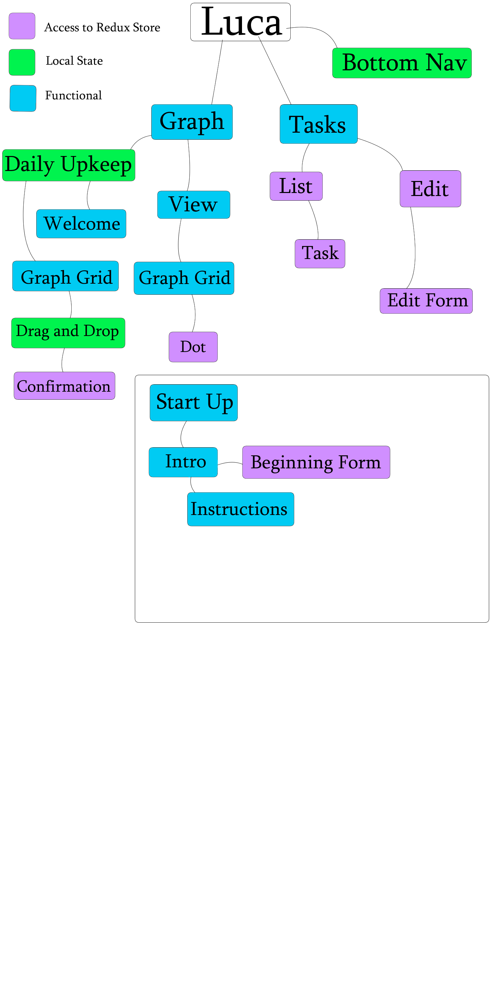
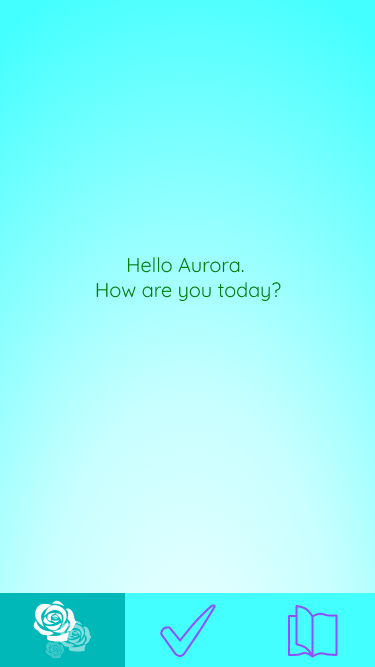
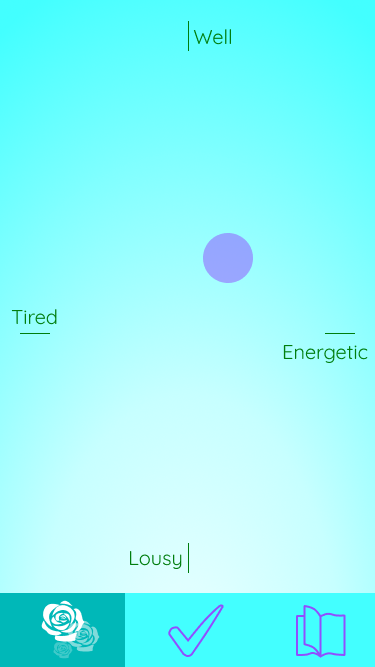
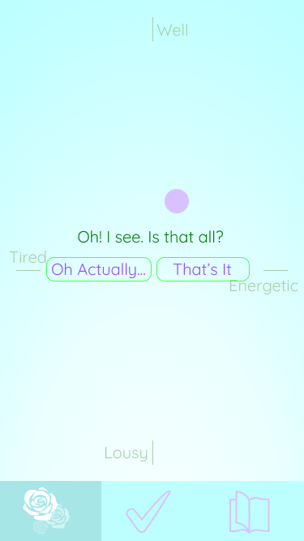
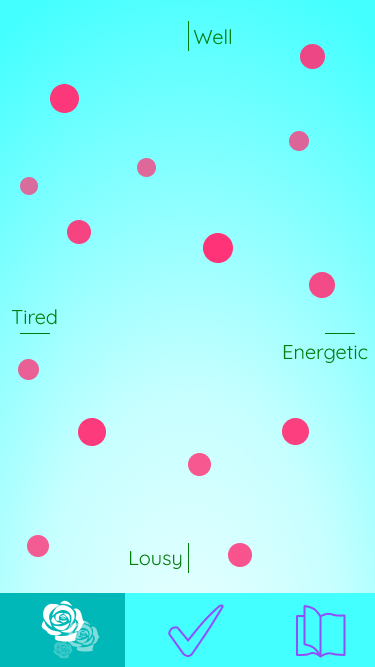
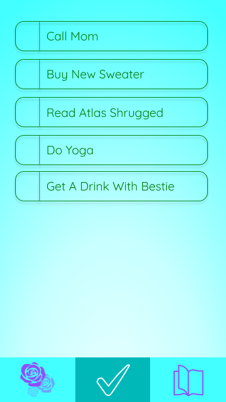
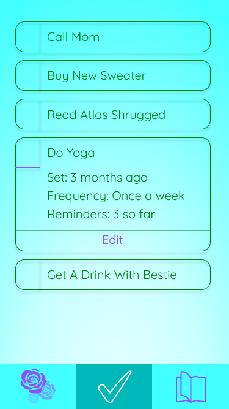
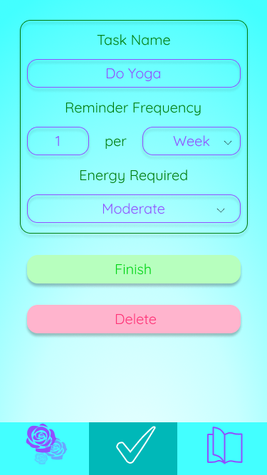
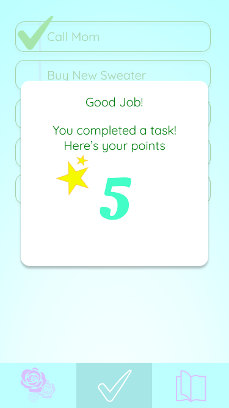

# _LUCA_

#### _A mobile app for tracking goals and maintaining mental health._

#### By _**Aurora Shido-Wagenet**_

## Description

_Have you ever had a life tracking app that won't leave you alone? Day after day, messages prompting you to do more stuff than is possible, especially when the day isn't going your way to begin with. Pushy, annoying, and most of all unhelpful. But LUCA is different. Luca only send notifications based on the settings you give it for each task, and how much energy you tell it you have that day. Feeling bad? Don't stress. LUCA won't bother you or make you feel anxious because you're not working on something. Maybe you're having a great morning? LUCA will remind you of a few extra things, to get the most out of your day. A simple interface made to help you live the best life you can._

## Component Tree

## Wireframes

_intro when app is opened_

_dragging pin_

_dropped pin confirmation_

_logged graph_

_task list_

_task details_

_edit task_

_task completed_

## Redux Store Format

{
  profile: {
    created: (boolean of if user has set profile yet)
    name: (name),
    favColor: (hex code),
    pins: [
      (id): {
        x: (x-index),
        y: (y-index),
        date: (date created),
        id: (id)
      }
    ],
    tasks: [
      (taskName): {
        name: (task name),
        frequency: (frequency of reminder),
        energy: (energy required for task),
        set: (date set),
        reminders: (number of reminders about this task so far)
      }
    ]
  }
}

<!-- ### Unforseen Issues
_Webpack configuring took longer than expected; getting everything working perfectly in that might be a longer process than coding any individual feature_
_PropTypes aren't working; the props themselves are but I'm not sure why the PropTypes woudln't be._
_Styling between components can be tricky. Sometimes I needed to set the width in the parent component instead._

## Setup/Installation Requirements

* _Use your command terminal (gitbash if you're using a windows machine) to clone the latest commit from Github, using the url provided_
* _Open with a text editor such as Atom to view the code_
* _In your terminal run the command "npm install"_
* _Then, run the command "npm run start" to view_

## Known Bugs

_Kegs can be drained past 0_

## Support and contact details

_If you encounter any bugs or issues not documented during your experience, please feel free to contact me at my email: fullmetalwoman@gmail.com_

## Technologies used

_This application was created using React with JSX_

### License

Copyright (c) 2019 **_ Aurora Shido-Wagenet_**

Permission is hereby granted, free of charge, to any person obtaining a copy
of this software and associated documentation files (the "Software"), to deal
in the Software without restriction, including without limitation the rights
to use, copy, modify, merge, publish, distribute, sublicense, and/or sell
copies of the Software, and to permit persons to whom the Software is
furnished to do so, subject to the following conditions:

The above copyright notice and this permission notice shall be included in all
copies or substantial portions of the Software.

THE SOFTWARE IS PROVIDED "AS IS", WITHOUT WARRANTY OF ANY KIND, EXPRESS OR
IMPLIED, INCLUDING BUT NOT LIMITED TO THE WARRANTIES OF MERCHANTABILITY,
FITNESS FOR A PARTICULAR PURPOSE AND NONINFRINGEMENT. IN NO EVENT SHALL THE
AUTHORS OR COPYRIGHT HOLDERS BE LIABLE FOR ANY CLAIM, DAMAGES OR OTHER
LIABILITY, WHETHER IN AN ACTION OF CONTRACT, TORT OR OTHERWISE, ARISING FROM,
OUT OF OR IN CONNECTION WITH THE SOFTWARE OR THE USE OR OTHER DEALINGS IN THE
SOFTWARE. -->
